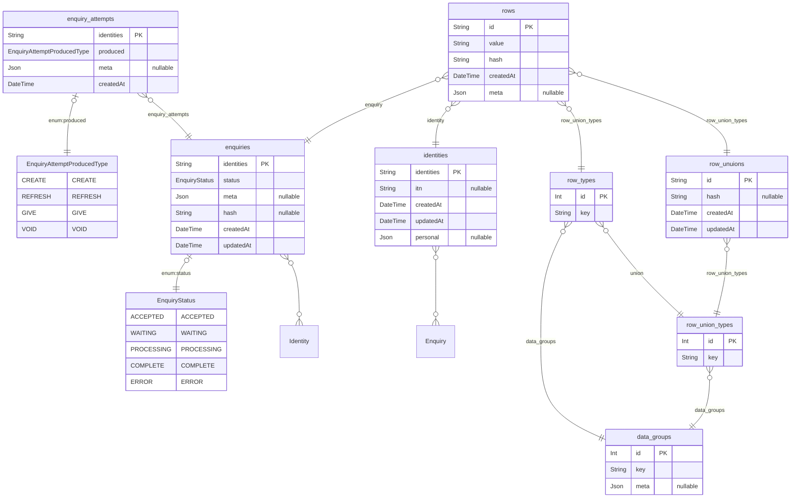

## Запуск контейнера
- Клонируйте репозиторий, перейдите в директорию с проектом, переименуйте `.env.example` в `.env`:
```
git clone https://gitlab.com/ittinc/sweep-net.git odyssey-adapter
cd odyssey-adapter
mv .env.example .env
```
- Теперь необходимо заполнить пустые переменные в файле .env
- После заполнения .env, запустите:
```
docker-compose up -d
```
- Когда контейнер запустится, приложение будет доступно по адресу, сконфигурированному в `.env` 
  - по дефолту: `http://localhost:3333`

## [Описание ключей ответа](./dataset.md)

## [Схема базы данных](./schema.png)
